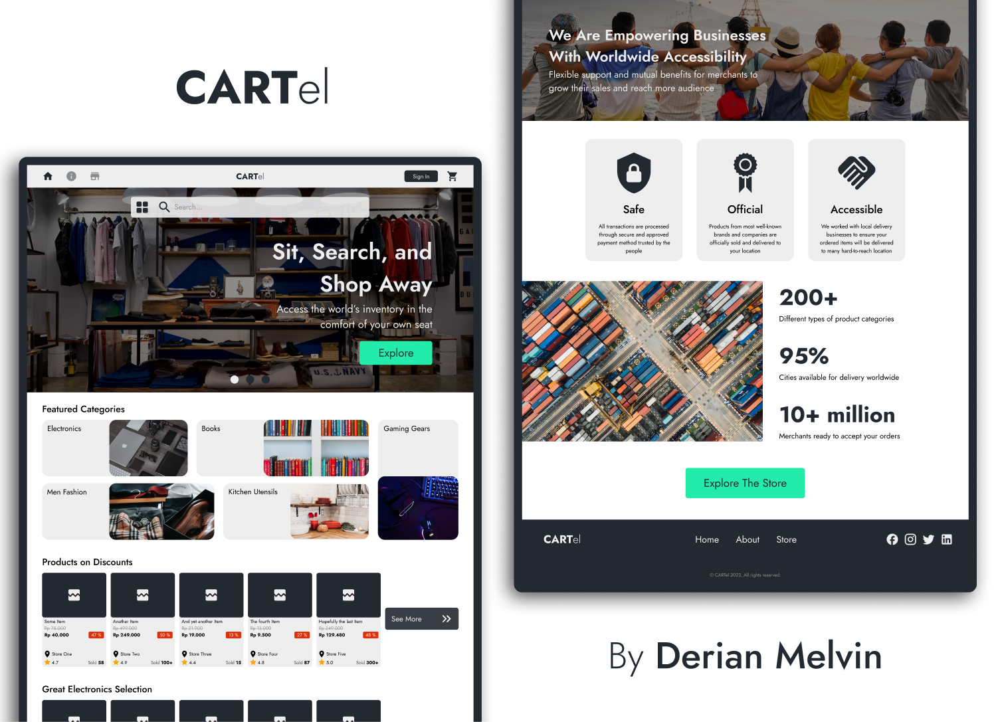
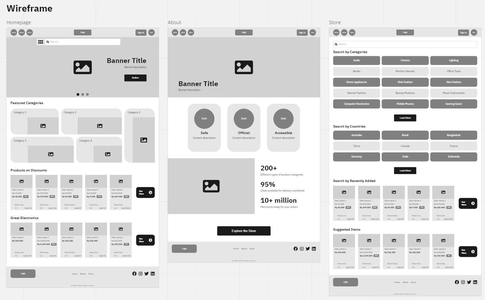
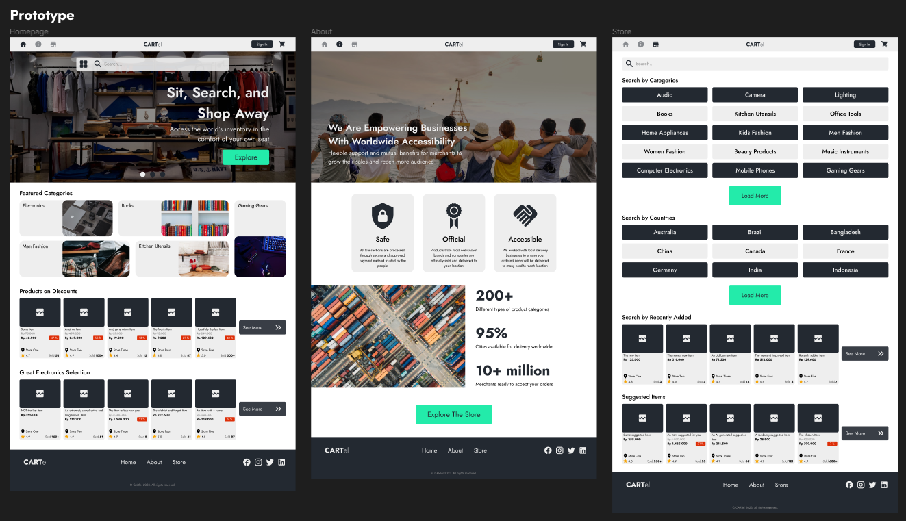

# UI / UX Assignment - Week 2

## 👋 Greetings!

This is a fictional company profile website called **CARTel**, a simple e-commerce website inspired by well-known websites like **Tokopedia** and **Bukalapak**, but made with some elements of minimalist design. I hope you enjoy it ✌️.

## 🔗 Links

### [Miro](https://miro.com/app/board/uXjVPuWNC5Y=/?share_link_id=971049923506) - Wireframe

### [Figma](https://www.figma.com/file/XlwwlsYlHkeo1Pe0LIIfht/W2---Website-Design---Derian-Melvin?node-id=0%3A1&t=0Y3DpQAm9triH5t1-1) - Mockup & Prototype

## Screenshots

### Miro

### Figma

## ✨ Website Inspirations

- [Tokopedia]()
- [Bukalapak]()
- [E-Commerce Minimal Concept by Irakli (ikako) talavadze](https://www.behance.net/gallery/140261723/E-Commerce-UXUI-Minimal-Concept)
- [Online Store Concept by Lyashenkoart](https://dribbble.com/shots/16688455-Online-store-COMFORT)

## 🎨 Design Resources

| Websites | Usage |
| :------- | ----: |
| [Unsplash](https://unsplash.com/) | Image Assets |
| [Colorhunt](https://colorhunt.co/palette/232931393e464ecca3eeeeee) | Color Palettes |

| Colors | Code |
| :----- | ---: |
| Black | #232931 |
| Dark Grey | #393E46 |
| Teal | #4ECCA3 |
| Whitesmoke | #EEEEEE |

### Fonts Used
- Jost